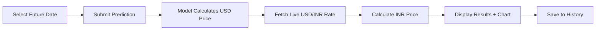

# 💰 Gold Price Predictor

> An intelligent machine learning application that forecasts gold prices using Polynomial Regression with real-time currency conversion

[](https://www.python.org/)
[](https://flask.palletsprojects.com/)
[](LICENSE)
[]()

---

## 📖 Table of Contents

- [About](#about)
- [Features](#features)
- [Demo](#demo)
- [Getting Started](#getting-started)
- [Technology Stack](#technology-stack)
- [How It Works](#how-it-works)
- [Project Structure](#project-structure)
- [API Reference](#api-reference)
- [Deployment](#deployment)
- [Screenshots](#screenshots)
- [Roadmap](#roadmap)
- [Contributing](#contributing)
- [License](#license)
- [Contact](#contact)

---

## 🎯 About

**Gold Price Predictor** is a full-stack web application that leverages machine learning to predict future gold prices. Using historical price data from 2010 onwards, the application trains a Polynomial Regression model to forecast prices and automatically converts them to Indian Rupees (INR) using live exchange rates.

### Why This Project?

- **Educational Tool**: Learn about ML model deployment and web development
- **Real-world Application**: Understand gold price trends and patterns
- **Technical Showcase**: Demonstrates integration of ML, Flask, and external APIs

---

## ⚡ Features

<table>
<tr>
<td>

### Core Functionality
- 🤖 **ML-Powered Predictions** using Polynomial Regression (degree 3)
- 💱 **Live Currency Conversion** with USD to INR API
- 📊 **Interactive Visualizations** using Matplotlib
- 🕐 **Session-based History** tracking
- 📈 **Trend Analysis** and year comparisons

</td>
<td>

### User Experience
- 🎨 **Modern Dark Theme** with gold accents
- 📱 **Fully Responsive** mobile and desktop layout
- ⚡ **Real-time Updates** with smooth animations
- 🔄 **Embedded Live Widget** from dpgold.com
- 🧮 **Detailed Breakdown** of price calculations

</td>
</tr>
</table>

---

## 🎬 Demo

### Live Prediction Flow



### Sample Output

**Input**: Predict price for `2026-12-31`

**Output**:
```
Predicted Gold Price: $2,487.50 USD

Price Breakdown:
├─ Original Price (per ounce): $2,487.50
├─ After 6% Import Duty: ₹6,845.23
├─ After 3% GST: ₹7,050.59
├─ Final Price (per gram): ₹7,050.59
└─ Final Price (per 10 grams): ₹70,505.90

Model Metrics:
• R-Squared: 0.95
• MSE: 234.56
• RMSE: 15.32
```

---

## 🚀 Getting Started

### Prerequisites

Ensure you have the following installed:

```bash
Python 3.8+
pip
Git
```

### Installation

**1. Clone the repository**

```bash
git clone https://github.com/yourusername/gold-price-predictor.git
cd gold-price-predictor
```

**2. Create and activate virtual environment**

```bash
# Windows
python -m venv venv
venv\Scripts\activate

# macOS/Linux
python3 -m venv venv
source venv/bin/activate
```

**3. Install dependencies**

```bash
pip install -r requirements.txt
```

**4. Verify dataset**

Ensure `GOLD_prices_2010_to_today.csv` exists with these columns:
- `Date` - Format: YYYY-MM-DD
- `Close` - Gold closing price in USD

**5. Run the application**

```bash
python app.py
```

**6. Access the application**

Open your browser and navigate to:
```
http://localhost:5000
```

---

## 🛠️ Technology Stack

### Backend


### Frontend


### Visualization


### External APIs
- **Exchange Rate API**: [open.er-api.com](https://open.er-api.com)
- **Live Gold Widget**: [dpgold.com](https://www.dpgold.com)

---

## 🧠 How It Works

### 1. Data Processing Pipeline

```python
# Load historical data
df = pd.read_csv('GOLD_prices_2010_to_today.csv')

# Clean and prepare
df['Date'] = pd.to_datetime(df['Date'])
df['Days'] = (df['Date'] - df['Date'].min()).dt.days

# Split data
train_size = int(0.8 * len(df))
X_train, y_train = df['Days'][:train_size], df['Close'][:train_size]
```

### 2. Model Training

```python
from sklearn.preprocessing import PolynomialFeatures
from sklearn.linear_model import LinearRegression
from sklearn.pipeline import make_pipeline

# Create polynomial regression model
model = make_pipeline(
    PolynomialFeatures(degree=3),
    LinearRegression()
)

# Train the model
model.fit(X_train, y_train)

# Save model
pickle.dump(model, open('gold_price_model.pkl', 'wb'))
```

### 3. Prediction Process

**Mathematical Formula**:
```
Price(t) = β₀ + β₁t + β₂t² + β₃t³

Where:
t = days since earliest date
β₀, β₁, β₂, β₃ = learned coefficients
```

### 4. Currency Conversion

```python
# Fetch live USD to INR rate
usd_to_inr_rate = get_usd_to_inr()  # e.g., 83.5

# Convert from troy ounce to grams and apply charges
price_per_gram = (usd_price * usd_to_inr_rate) / 31.103
with_import_duty = price_per_gram * 1.06  # 6% import duty
final_price = with_import_duty * 1.03      # 3% GST
```

---

## 📂 Project Structure

```
gold-price-predictor/
│
├── 📄 app.py                          # Flask application (main entry point)
├── 📊 GOLD_prices_2010_to_today.csv   # Historical gold price dataset
├── 🤖 gold_price_model.pkl            # Trained ML model (auto-generated)
├── 📋 requirements.txt                # Python dependencies
├── 📖 README.md                       # Documentation (this file)
│
├── 📁 templates/
│   └── index_dashboard.html           # Main dashboard UI
│
├── 📁 .mpl_config/                    # Matplotlib config (auto-generated)
│
└── 📁 static/                         # (Optional) CSS, JS, images
```

### Key Files Explained

| File | Purpose |
|------|---------|
| `app.py` | Flask routes, model training, API integration |
| `index_dashboard.html` | Responsive dashboard with dark theme UI |
| `GOLD_prices_2010_to_today.csv` | Training data with Date and Close columns |
| `gold_price_model.pkl` | Serialized trained model for predictions |

---

## 🔌 API Reference

### External API: USD to INR Exchange Rate

**Endpoint**: 
```
GET https://open.er-api.com/v6/latest/USD
```

**Response Sample**:
```json
{
  "result": "success",
  "time_last_update_utc": "Sun, 05 Jan 2026 00:00:01 +0000",
  "rates": {
    "INR": 83.45,
    "EUR": 0.85,
    ...
  }
}
```

**Implementation**:
```python
def get_usd_to_inr():
    # Cache for 1 hour
    if cache_valid():
        return cached_rate
    
    # Fetch from API
    response = requests.get("https://open.er-api.com/v6/latest/USD", timeout=5)
    rate = response.json()["rates"]["INR"]
    
    # Update cache
    cache_update(rate)
    return rate
```

### Application Routes

| Route | Method | Description |
|-------|--------|-------------|
| `/` | GET, POST | Main prediction page |
| `/history` | GET | View prediction history |
| `/trends` | GET | Display price trends chart |
| `/compare` | GET, POST | Compare prices between years |
| `/about` | GET | Model information |
| `/clear_history` | POST | Clear session history |
| `/usd_to_inr` | GET | Get current exchange rate (JSON) |

---

## 🌐 Deployment

### Deploy on Render.com

**Step 1**: Create `render.yaml`

```yaml
services:
  - type: web
    name: gold-price-predictor
    env: python
    region: singapore
    plan: free
    buildCommand: pip install -r requirements.txt
    startCommand: gunicorn app:app
    envVars:
      - key: PYTHON_VERSION
        value: 3.9.0
```

**Step 2**: Add Gunicorn to requirements

```bash
echo "gunicorn==20.1.0" >> requirements.txt
```

**Step 3**: Deploy

1. Push code to GitHub
2. Connect repository to Render
3. Deploy automatically

### Deploy on Heroku

**Step 1**: Create `Procfile`

```
web: gunicorn app:app
```

**Step 2**: Deploy

```bash
# Login to Heroku
heroku login

# Create app
heroku create gold-price-predictor

# Deploy
git push heroku main

# Open app
heroku open
```

### Deploy on PythonAnywhere

1. Upload files to PythonAnywhere
2. Create virtual environment
3. Configure WSGI file
4. Set working directory
5. Reload application

---

## 📸 Screenshots

### Main Dashboard
```
┌──────────────────────────────────────────────────────────────┐
│  🏆 Gold Analytics AI Predictor                              │
├──────────────────────────────────────────────────────────────┤
│  Metrics:   R²: 0.95  |  MSE: 234.56  |  RMSE: 15.32        │
├──────────────────────────────────────────────────────────────┤
│  🔮 Make a Prediction                                        │
│  ┌────────────────┐  ┌──────────────┐                       │
│  │ Date: 2026-12-31│  │ Predict Price │                      │
│  └────────────────┘  └──────────────┘                       │
│                                                              │
│  ╔══════════════════════════════════════╗                   │
│  ║  Predicted Gold Price: $2,487.50    ║                   │
│  ║  Final INR Price: ₹70,505.90 /10g  ║                   │
│  ╚══════════════════════════════════════╝                   │
│                                                              │
│  📊 [Interactive Price Chart]                               │
└──────────────────────────────────────────────────────────────┘
```

*(Add actual screenshots here)*

---

## 🗺️ Roadmap

### Version 2.0 (Planned)

- [ ] Add LSTM neural network model
- [ ] Implement user authentication
- [ ] Database integration (PostgreSQL)
- [ ] Email notifications for price alerts
- [ ] Export predictions to PDF/Excel
- [ ] Multi-currency support (EUR, GBP, etc.)
- [ ] Historical data auto-update feature
- [ ] Mobile app (React Native)

### Future Enhancements

- [ ] Sentiment analysis from news articles
- [ ] Integration with stock market APIs
- [ ] Comparison with other precious metals
- [ ] Advanced statistical analysis tools
- [ ] REST API for third-party integration

---

## 🤝 Contributing

Contributions make the open-source community an amazing place to learn and create. Any contributions you make are **greatly appreciated**.

### How to Contribute

1. **Fork the Project**
2. **Create your Feature Branch**
   ```bash
   git checkout -b feature/AmazingFeature
   ```
3. **Commit your Changes**
   ```bash
   git commit -m 'Add some AmazingFeature'
   ```
4. **Push to the Branch**
   ```bash
   git push origin feature/AmazingFeature
   ```
5. **Open a Pull Request**

### Contribution Guidelines

- Write clear commit messages
- Follow PEP 8 style guide for Python
- Add comments for complex logic
- Update documentation as needed
- Test thoroughly before submitting

---

## ⚠️ Important Disclaimer

```
┌─────────────────────────────────────────────────────────────┐
│  ⚠️  EDUCATIONAL PURPOSE ONLY                               │
├─────────────────────────────────────────────────────────────┤
│  This application is a demonstration project and should     │
│  NOT be used for actual financial decisions or investment.  │
│                                                             │
│  • Predictions are based on historical patterns only        │
│  • Does not account for market events or economic factors   │
│  • Not financial advice - consult professionals             │
│  • Past performance ≠ future results                        │
└─────────────────────────────────────────────────────────────┘
```

---

## 📄 License

Distributed under the MIT License. See `LICENSE` file for more information.

```
MIT License

Copyright (c) 2026 Your Name

Permission is hereby granted, free of charge, to any person obtaining a copy
of this software and associated documentation files...
```

---

## 👤 Contact

**Your Name**

- 🌐 Portfolio: [yourwebsite.com](https://yourwebsite.com)
- 💼 LinkedIn: [kalyanasrinivasbonagiri](www.linkedin.com/in/kalyanasrinivas-bonagiri-a33709322)
- 📧 Email: kalyanasrinivasbonagiri@gmail.com
- 🐙 GitHub: [@kalyanasrinivasbonagiri-lang]([https://github.com/yourusername](https://github.com/kalyanasrinivasbonagiri-lang))

**Project Link**: [https://github.com/yourusername/gold-price-predictor](https://github.com/yourusername/gold-price-predictor)

---

## 🙏 Acknowledgments

Special thanks to:

* [Scikit-learn](https://scikit-learn.org/) - Machine learning library
* [Flask](https://flask.palletsprojects.com/) - Web framework
* [Pandas](https://pandas.pydata.org/) - Data manipulation
* [Matplotlib](https://matplotlib.org/) - Visualization
* [open.er-api.com](https://open.er-api.com) - Exchange rate API
* [dpgold.com](https://www.dpgold.com) - Live gold price widget
* All contributors who helped improve this project

---

<div align="center">

### ⭐ Star this repo if you found it helpful!

**Made with ❤️ using Python and Machine Learning**

[⬆ Back to Top](#-gold-price-predictor)

</div>
